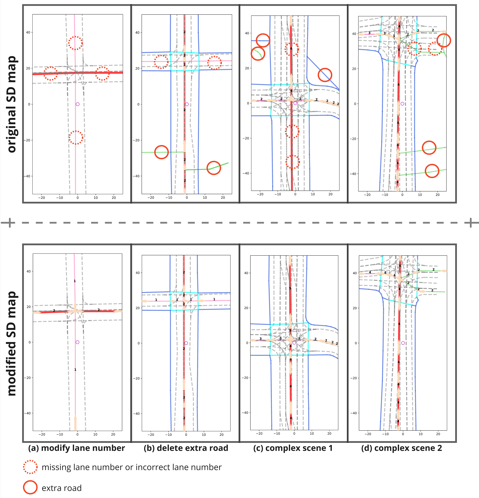
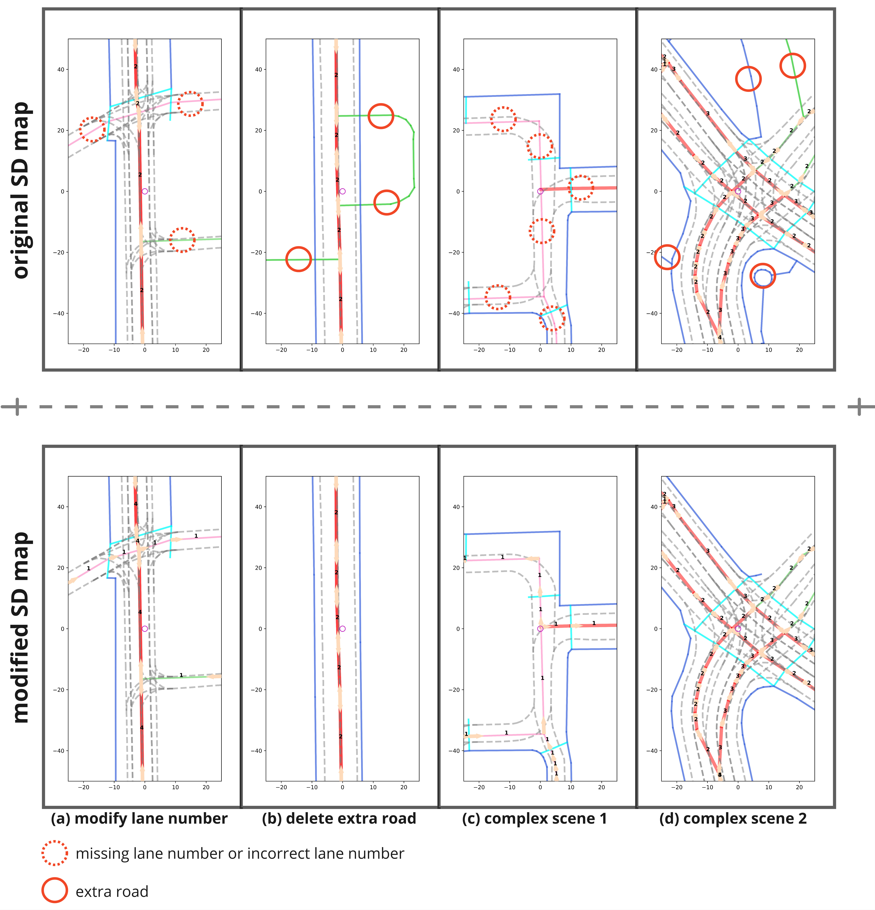
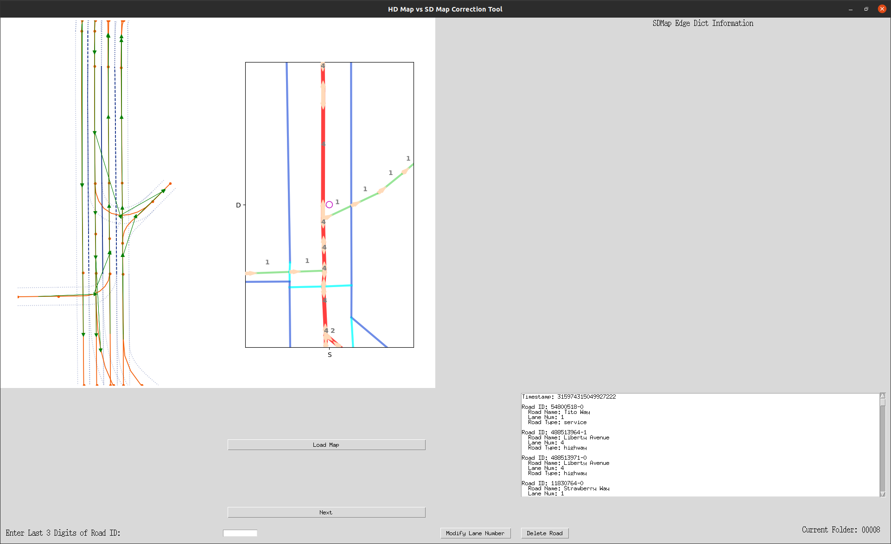
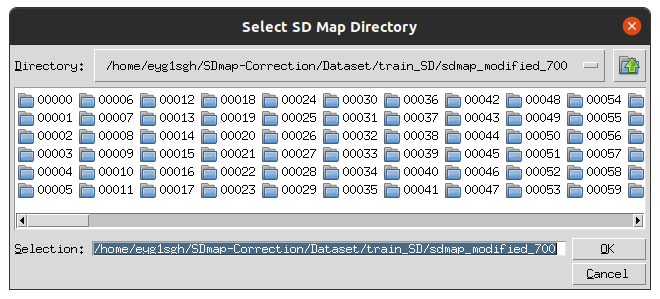
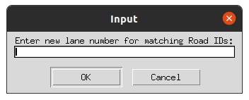
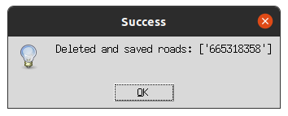
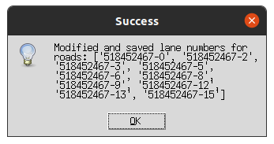
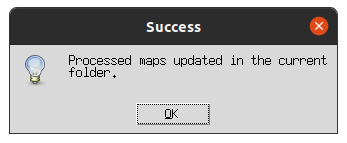
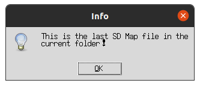
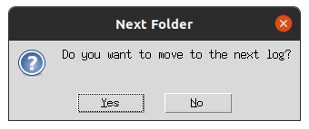

<div align="center">
<h2>Control Map Distribution using Map Query Bank for Online Map Generation</h2>


**Ziming Liu**<sup>1</sup>, **Leichen Wang**<sup>1</sup>, **Ge Yang**<sup>1,2</sup>, **Xinrun Li**<sup>1,3</sup>, **Xingtao Hu**<sup>1</sup>, **Hao Sun**<sup>1</sup>, **Guanyu Gao**<sup>4</sup>  

<sup>1</sup> AID-OMG Team, Bosch Research, Shanghai, China, <sup>2</sup> University of Stuttgart, Stuttgart, Germany, <sup>3</sup> Newcastle University, Newcastle upon Tyne, England, <sup>4</sup> Beijing Institute of Technology, Beijing, China 

**Submitted to IEEE Robotics and Automation Letters (RA-L)**

[](https://arxiv.org/pdf/2504.03868) &nbsp;[](https://drive.google.com/drive/folders/1L5qAiqbBcjK14312f6bk2BQam-prd5YB?usp=sharing) &nbsp;[](https://github.com/)

</div>

---

## Overview

**High-definition (HD) maps** are essential for autonomous driving, providing the detailed and accurate map information needed for **planning** and **navigation**.  
However, building and maintaining HD maps is **complex**, **expensive**, and **time-consuming**, making it difficult to scale across diverse environments.

To address this challenge, we propose a  **Online Map Generation (OMG)** framework. Our method leverages **low-cost** and **readily available** **Standard-definition (SD) maps** as strong priors to enable efficient and reliable HD map detection and generation on-the-fly.

---

## ✨ Our Contributions

✅ **Generalizable MQBank**  
- A new map representation that learns **feature embeddings** rather than relying on fixed position encoding.  

✅ **SD Map Prior Query Initialization**  
- The **first** approach using SD maps for **dynamic map query initialization**, breaking the performance ceiling of existing Transformer-based OMG models.  

✅ **Attention Layer Enhancements**  
- Incorporates MQBank directly into **map decoder attention layers**, enabling better **local point feature capture**.  

✅ **Extended OpenLaneV2 Dataset**  
- A manually verified and corrected SD map subset for OpenLaneV2, publicly available to the research community.

---

## 🔥 Experimental Highlights

- Achieved **state-of-the-art performance** on OpenLaneV2 benchmark:  
  - **40.5% mAP** on vehicle lanes  
  - **45.7% mAP** on pedestrian areas  
- **New insight** into the impact of SD map prior quality on HD map generation.

---

## 📦 Dataset Release  

We release our extended OpenLaneV2 Dataset with high-quality SD map annotations:  

### 🔗 Download Links

| Resource                  | Link                                                                                                                                      |
|---------------------------|-------------------------------------------------------------------------------------------------------------------------------------------|
| OpenLaneV2 Dataset        | [](https://github.com/OpenDriveLab/OpenLane-V2) |
| Our Extended SD Map Subset| [](https://drive.google.com/drive/folders/1L5qAiqbBcjK14312f6bk2BQam-prd5YB?usp=sharing) |

### 📁 Dataset Structure

After downloading the **Extended SDMap Subset**, the folder structure is as follows:
```
sdmap_train_modified/
├── 00000/
├── 00001/
├── ...
├── 00699/
└── info_train.json

sdmap_val_modified/
├── 10000/
├── 10001/
├── ...
├── 10149/
└── info_val.json
```
### 📄 `info_train.json` and `info_val.json` Description

These JSON files provide a **validity index** for each scene log in the dataset.  
Each key corresponds to a scene folder (e.g., `00000`, `00001`, ...), and the value indicates whether the scene contains a **usable and verified SD map**.

---

## Qualitative analysis of extended sdmap subset


The following images showcase the comparison between the original SDMap and the modified SDMap for four different scenarios.

- **Gray dashed lines** represent the ground truth HDMap.
- **Colored solid lines** represent the SDMap.


#### Scenario 1:



#### Scenario 2:


#### Scenario 3:


---

#### Original vs Modified SDMap (Animated Comparison):


- **Left GIF**: Original SDMap
- **Right GIF**: Modified SDMap

<table>
  <tr>
    <td></td>
    <td></td>
  </tr>
</table>

---

### Using GUI to Edit SDMap

This section explains the step-by-step process of editing an SDMap using the GUI interface. Below are the detailed steps:

---

#### 1. Basic Interface

The GUI provides a user-friendly interface to load and edit SDMaps. Upon starting the application, you will see the following main screen:



---

#### 2. Select `log_id`

Select the desired `log_id` corresponding to the specific SDMap you wish to edit.



---

#### 3. Edit the Number of Lanes

Select a road in the map to modify the lane number. The lane number field is editable, allowing you to input the correct number of lanes.



---

#### 4. Delete a Road

To remove a road from the map, select the road and click the **Delete Road** button.



---

#### 5. Save Edited Lane Numbers

After making changes to the lane numbers or deleting roads, the updated information will be written back to the SDMap.




---

#### 6. Jump to the Next `log_id`

Once you've finished editing the current `log_id`, click the **Next** button to proceed to the next map for editing. This allows for efficient processing of multiple maps.




---
## 📖 Citation
If you find our **paper** or **dataset** helpful, please consider giving us a ⭐ and citing our work:

```bibtex
@misc{liu2025general,
    title        = {Map Query Bank: A New Map Representation for Online Map Generation in Autonomous Driving},
    author       = {Ziming Liu and Leichen Wang and Ge Yang and Xinrun Li and Xingtao Hu and Hao Sun and Guanyu Gao},
    year         = {2025},
    publisher    = {GitHub},
    howpublished = {\url{https://github.com/LaoWangBosch/Map_Query_Bank}},
    note         = {Extended OpenLaneV2 Dataset with SD map annotations available at GitHub}
}

```